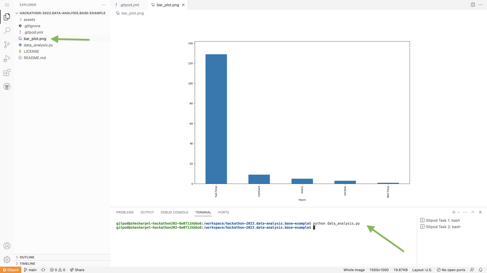

# hackathon-2023.data-analysis.base-example

## Introduction

This project utilizes Python, Pandas and Gitpod for data analysis of job data available in CSV format.  

Pandas is a powerful data manipulation and analysis library for Python. It provides data structures and functions to efficiently handle and analyze structured data.

With Gitpod, you can easily set up the project environment and start using these libraries for your data analysis.

## Prerequisites

Before getting started, make sure you have the following prerequisites:

- **Git**: Git is a version control system that allows you to track changes in your code and collaborate with others. If you don't have Git installed, you can download and install it from the official website: [Git Downloads](https://git-scm.com/downloads).
- **Gitpod account**: Gitpod is an online integrated development environment (IDE) that makes it easy to set up and work on projects without the need to install any software locally on your computer. With Gitpod, you can quickly start coding in a fully-featured development environment right from your web browser. To get started, you'll need to sign up for a free Gitpod account on the Gitpod website: [Gitpod Sign Up](https://www.gitpod.io/)

Once you have Git and a Gitpod account set up, you'll be ready to fork and work on projects using Gitpod's online IDE.

## Installation

To start using this project in Gitpod, follow these steps:

1. Fork the repository by clicking the "Fork" button in the top right corner of the repository page. This creates a copy of the repository in your GitHub account.

2. Click the following link to open this repository in Gitpod: [Open in Gitpod](https://gitpod.io/#https://github.com/shesharpnl/hackathon-2023.data-analysis.base-example)

3. Gitpod will open the project in a new workspace, providing you with an integrated development environment (IDE) for writing and running code.

## Usage

To use the Pandas and Matplotlib libraries for data analysis, follow these steps:

1. Open the `data_analysis.py` file in the IDE interface provided by Gitpod. You can find it in the project files: "Explorer" section (top right of the IDE).

2. In the Gitpod terminal, execute the `data_analysis.py` script using the following command:

   ```bash
   python data_analysis.py
   ```

3. The script will generate a bar plot based on the provided CSV data and save it as `bar_plot.png`.

4. You can view the generated plot by clicking on the "Preview" button in the top right corner of the Gitpod IDE. The plot will be displayed in the Gitpod preview.

5. Feel free to explore and modify the code to perform additional data analysis tasks using Pandas and Matplotlib.



## Contributing

Contributions to this project are welcome! If you find a bug, have a feature request, or want to contribute code, please follow these guidelines:

1. Fork the repository and clone it to your local machine.
2. Create a new branch for your changes: `git checkout -b my-branch-name`
3. Make your changes, and test them thoroughly.
4. Commit your changes with a descriptive commit message.
5. Push your changes to your forked repository: `git push origin my-branch-name`
6. Open a pull request against the main branch of this repository, explaining the changes you've made and why they are important.

Thank you for your contributions!

## Credits

The job data has been retrieved using [SourceStack](sourcestack.co).

## License

This project is licensed under the Apache License 2.0 - see the [LICENSE](LICENSE) file for details.

